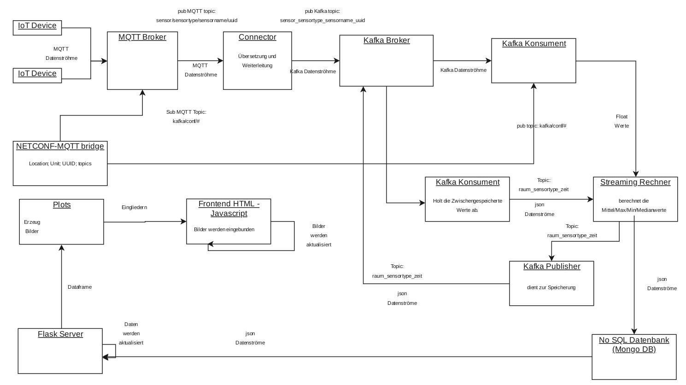

# Kafka Konnektor

## Installation

### MQTT Broker
https://mosquitto.org/

### MQTT Python
https://pypi.org/project/paho-mqtt/

### Kafka Broker
https://www.apache.org/dyn/closer.cgi?path=/kafka/2.5.0/kafka_2.12-2.5.0.tgz

### Kafka Python
https://kafka-python.readthedocs.io/en/master/install.html

### MongoDB
https://docs.mongodb.com/manual/installation/

### Flask Webserver
https://pypi.org/project/Flask/

## Starte die Server

### Start den MQTT Broker
sudo service mosquitto start 

### Starte Kafka Broker
https://kafka.apache.org/quickstart

### Starte den MongoDB
sudo mongod

## In confing.ini werden die IP Adressen mit Port von den Servern eingestellt.

## Starte die Simulation
start_simulation.py

